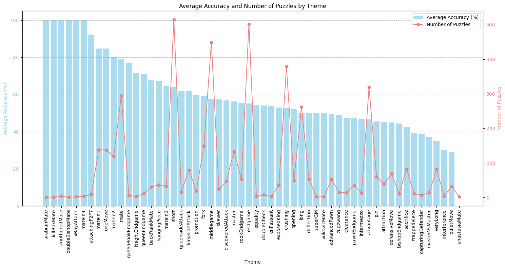
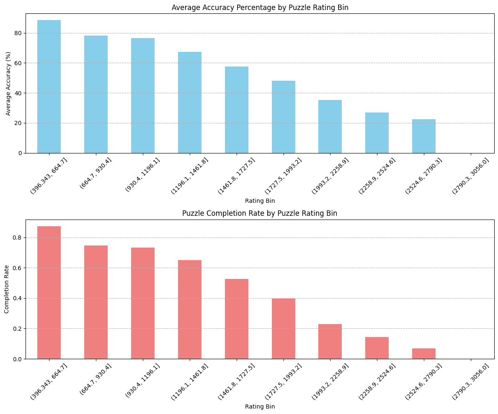

# Chess Puzzle Evaluator

A Python project for evaluating chess puzzles using OpenAI models and the Glicko-2 rating system. Using GPT-3.5-Turbo-Instruct, the model performs surprisingly well for complete Lichess puzzles with an accuracy of about 55%. This is likely lower than expected, as the prompt results in inconsistently-formatted outputs, which requires a robust parser to find the expected move.

## Quick Setup

1. **Install dependencies**:
   ```bash
   pip install -r requirements.txt
   ```

2. **Set up your OpenAI API key**:
   ```bash
   export OPENAI_API_KEY=<your key>
   ```
   Or create a `.env` file:
   ```env
   OPENAI_API_KEY=<your key>
   ```

## Usage

### Basic Commands

```bash
# Show help
python main.py --help

# Show puzzle statistics
python main.py --stats

# Evaluate 10 puzzles with GPT-3.5
python main.py --evaluate --max-puzzles 10

# Evaluate with GPT-4
python main.py --evaluate --max-puzzles 5 --model gpt-4-turbo

# Sample 100 puzzles and evaluate
python main.py --sample 100 --evaluate --max-puzzles 50

# Calculate Glicko-2 rating (after evaluation)
python main.py --rating
```

### Programmatic Usage

```python
from csv_reader import read_chess_puzzles_csv, sample_puzzles
from model_interface import ChessModelInterface
from chess_utils import build_chess_prompts
from glicko_rating import update_agent_rating_from_puzzles

# Load data
df = read_chess_puzzles_csv("lichess_puzzles_with_pgn_1000.csv")
df_sample = sample_puzzles(df, n=100)

# Initialize model
model = ChessModelInterface(api_key="your-api-key")

# Evaluate puzzles
# ... (see main.py for complete example)
```

## Results and Analysis

### Performance by Puzzle Theme


### Performance by Puzzle Rating


## Data Source and Citations

This project uses chess puzzles sampled from the [Lichess Open Database](https://database.lichess.org/#puzzles), which contains over 5.4 million chess puzzles rated and tagged by the Lichess community.

The evaluation methodology follows established approaches for LLM chess evaluation, using similar prompting strategies as described in:
- [Chess LLM Evaluation](https://nicholas.carlini.com/writing/2023/chess-llm.html) by Nicholas Carlini
- [More Chess Analysis](https://dynomight.net/more-chess/) by Dynomight

**Current Model**: GPT-3.5-turbo-instruct  
**Future Plans**: Evaluation of additional models including GPT-4, Claude, and other chess-specialized models

## Documentation

For detailed documentation, module descriptions, and technical details, see [DOCUMENTATION.md](DOCUMENTATION.md).