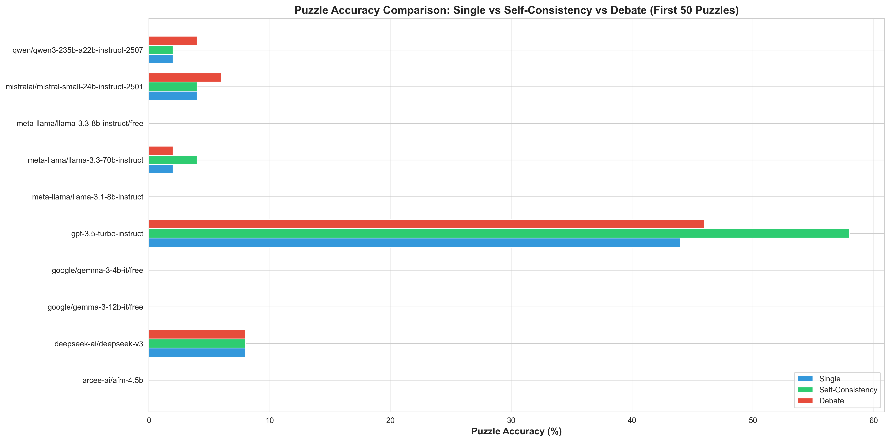
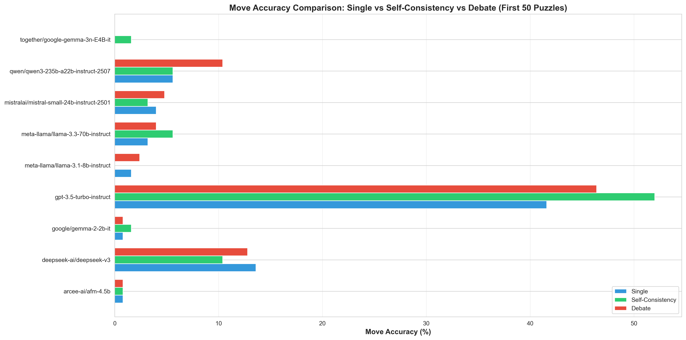
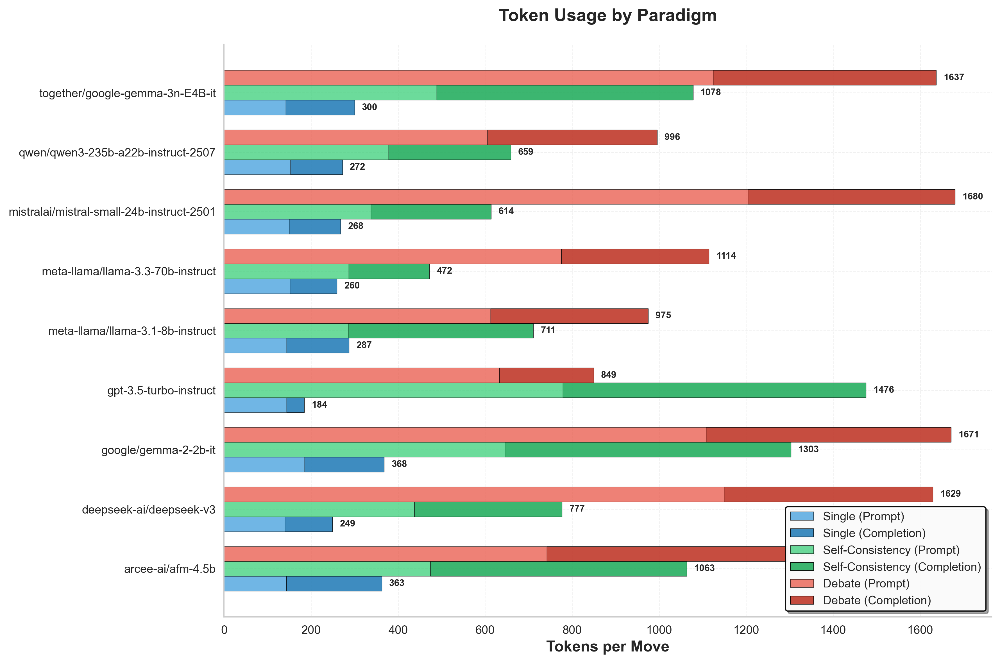

# Chess Puzzle Evaluator

A Python project for evaluating chess puzzles using multiple LLM paradigms (single model, self-consistency, and debate) across various models including OpenAI GPT-3.5-turbo-instruct and open-source models via Anannas API. The system evaluates models on Lichess puzzles and tracks accuracy, token usage, and error rates across different evaluation paradigms.

## Quick Setup

1. **Install dependencies**:
   ```bash
   pip install -r requirements.txt
   ```

2. **Set up your API key**:
   Create a `.env` file in the `chess_puzzles` directory:
   ```env
   OPENAI_API_KEY=your-openai-key-here
   # OR for open-source models:
   ANANNAS_API_KEY=your-anannas-key-here
   ANANNAS_API_URL=https://api.anannas.ai/v1
   ```

3. **Run minimal tests**:
   ```bash
   # Test 1 puzzle and 1 game
   python test_minimal.py
   ```

## Usage

### Testing Puzzles

```bash
# Quick test (1 puzzle, 1 game)
python test_minimal.py

# Show help
python main.py --help

# Evaluate 1 puzzle (minimal test) - Single Model
python main.py --evaluate --max-puzzles 1

# Evaluate 10 puzzles with GPT-3.5 - Single Model
python main.py --evaluate --max-puzzles 10

# Evaluate with self-consistency (3 agents, majority vote)
python main.py --evaluate --max-puzzles 10 --self-consistency

# Evaluate with debate (2 agents + moderator)
python main.py --evaluate --max-puzzles 10 --debate

# Evaluate with planning (request 3 future plies)
python main.py --evaluate --max-puzzles 10 --plan-plies 3

# Evaluate with open-source model via Anannas API
python main.py --evaluate --max-puzzles 10 --model deepseek-ai/deepseek-v3 --use-anannas

# Evaluate with GPT-4
python main.py --evaluate --max-puzzles 5 --model gpt-4-turbo

# Calculate Glicko-2 rating (after evaluation)
python main.py --rating
```

### Testing Games

```bash
# Play a single game against Stockfish (LLM as white)
cd chess_game_engine
python chess_game.py --save-pgn

# Play with self-consistency
python chess_game.py --self-consistency --save-pgn

# Play with planning (3 plies ahead)
python chess_game.py --plan-plies 3 --save-pgn

# Play as black
python chess_game.py --model-color black --save-pgn

# Play against Stockfish with custom skill level
python chess_game.py --skill 10 --save-pgn

# Play with open-source model
python chess_game.py --model deepseek-ai/deepseek-v3 --use-anannas --save-pgn

# Run a tournament matchup (2 models, 1 game each)
python run_tournament.py --pair gpt-3.5-turbo-instruct deepseek-ai/deepseek-v3 --games-per-matchup 1

# Run human vs LLM
python run_tournament.py --human-vs-llm --model gpt-3.5-turbo-instruct
```

### Programmatic Usage

```python
from csv_reader import read_chess_puzzles_csv, sample_puzzles
from model_interface import ChessModelInterface
from chess_utils import build_chess_prompts
from glicko_rating import update_agent_rating_from_puzzles

# Load data
df = read_chess_puzzles_csv("lichess_puzzles_with_pgn_1000.csv")
df_sample = sample_puzzles(df, n=100)

# Initialize model
model = ChessModelInterface(api_key="your-api-key")

# Evaluate puzzles
# ... (see main.py for complete example)
```

## Results and Analysis

### Paradigm Comparison (First 50 Puzzles)

The system evaluates three paradigms:
- **Single Model**: Direct query to a single model
- **Self-Consistency**: Three independent queries (Aggressive, Positional, Neutral GMs) with consensus voting
- **Debate**: Two-agent debate (Affirmative vs Negative) with moderator/judge, with early consensus when both agree

#### Puzzle Accuracy Comparison


#### Move Accuracy Comparison


#### Token Usage Comparison


### Sorted Performance Analysis

#### Puzzle Accuracy Sorted by Performance
All model-paradigm combinations sorted by puzzle accuracy (highest at top):


#### Token Usage Sorted by Efficiency
All model-paradigm combinations sorted by tokens per move (highest at top):


### Key Findings

1. **Debate Efficiency**: The debate system achieves early consensus 81.8% of the time for GPT-3.5-turbo-instruct, using only 2 queries instead of 3, resulting in 0.58x the tokens of self-consistency.

2. **Self-Consistency Token Usage**: Self-consistency uses approximately 3x the prompt tokens of single model (as expected with 3 queries), but completion tokens vary based on response length.

3. **Model Performance**: Different models show varying accuracy across paradigms, with some models performing better in single model mode while others benefit from multi-agent approaches.

4. **Token Tracking**: The system now properly tracks tokens for all paradigms, even when queries fail to extract moves, ensuring accurate cost analysis.

## Data Source and Citations

This project uses chess puzzles sampled from the [Lichess Open Database](https://database.lichess.org/#puzzles), which contains over 5.4 million chess puzzles rated and tagged by the Lichess community.

The evaluation methodology follows established approaches for LLM chess evaluation, using similar prompting strategies as described in:
- [Chess LLM Evaluation](https://nicholas.carlini.com/writing/2023/chess-llm.html) by Nicholas Carlini
- [More Chess Analysis](https://dynomight.net/more-chess/) by Dynomight

**Current Models Evaluated**:
- GPT-3.5-turbo-instruct (OpenAI)
- arcee-ai/afm-4.5b
- deepseek-ai/deepseek-v3
- google/gemma-2-2b-it
- meta-llama/llama-3.1-8b-instruct
- meta-llama/llama-3.3-70b-instruct
- mistralai/mistral-small-24b-instruct-2501
- qwen/qwen3-235b-a22b-instruct-2507
- together/google-gemma-3n-E4B-it

**Evaluation Paradigms**: Single Model, Self-Consistency, Debate V2

**Results Location**: `data/test_results/` (organized by paradigm: `single_50/`, `self_consistency_50/`, `debate_50/`)

## Documentation

For detailed documentation, module descriptions, and technical details, see [DOCUMENTATION.md](DOCUMENTATION.md).